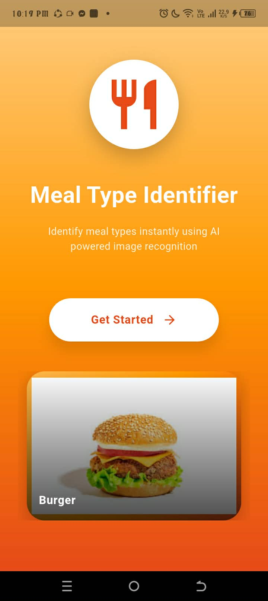
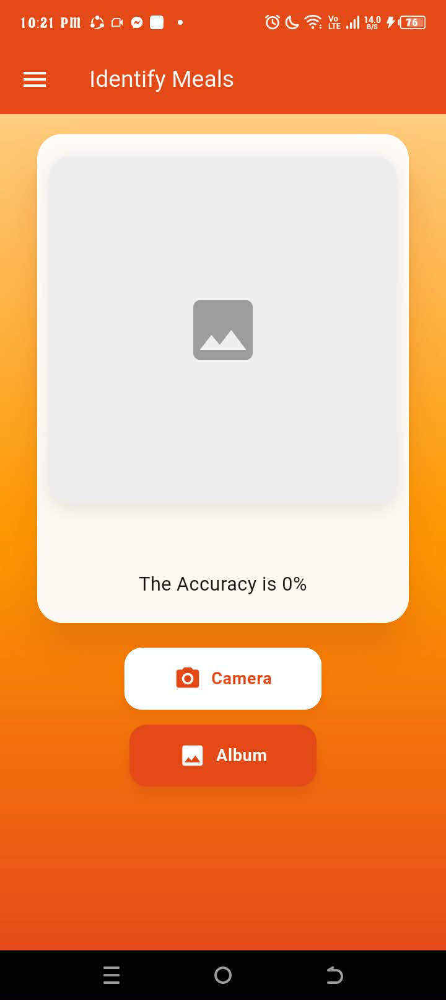
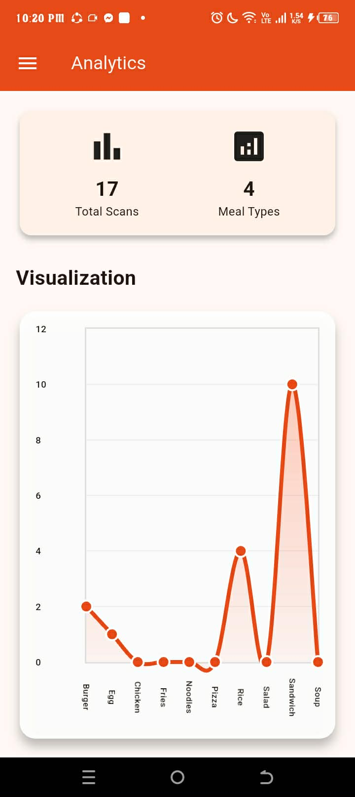
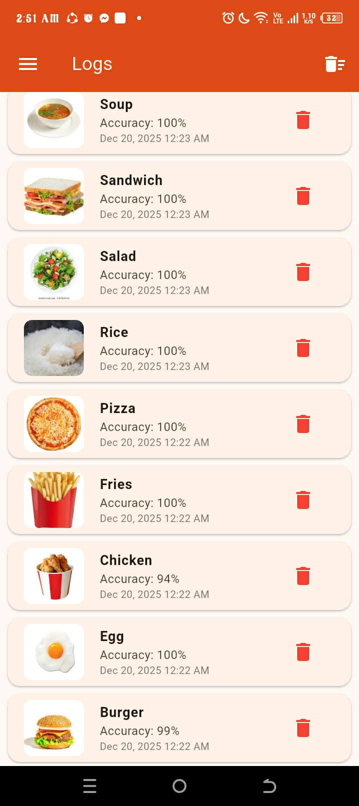

---

### Rjay Enriquez
**IT Student · Flutter & Web Developer · Aspiring Full‑Stack Developer**

---

## 🛠 Tech Stack

  

---

## 📊 GitHub Analytics

<!-- Main stats -->

<!-- Top languages -->

---

## 🖼️ App Screens (UI Preview)

| Home | Scan | Analytics | History |
|:----:|:----:|:---------:|:-------:|
|  |  |  |  |

---

## 💼 Other Featured Projects

| Project | Description | Tech Stack | Repository |
|:--------|:------------|:-----------|:-----------|
| **Enriquez_IT120_Act1** | Programming activities and exercises for IT120 | `Python` | [View Repo](https://github.com/Enriquez-Rjay/Enriquez_IT120_Act1.git) |
| **IT108** | Web development activities and fundamentals | `HTML` `CSS` `JavaScript` | [View Repo](https://github.com/Enriquez-Rjay/IT108.git) |
| **Enriquez_Quiz** | Quiz and practice projects for IT108 | `Web` | [View Repo](https://github.com/Enriquez-Rjay/IT108/tree/e0d1b9c88d7a984aa72b87dabfed1931577223e0/Enriquez_Quiz) |
| **Flutter_Widget_UIComponents** | Reusable Flutter UI components and widgets | `Flutter` `Dart` | [View Repo](https://github.com/Enriquez-Rjay/Enriquez_IT120_Act1/tree/main/Flutter_Widget_UIComponents) |
| **Mysql-Trigger-Implementation-Enriquez-** | MySQL trigger implementation and automation | `MySQL` `Database` | [View Repo](https://github.com/Enriquez-Rjay/Mysql-Trigger-Implementation-Enriquez-.git) |
| **Enriquez_Meal_Type_Classification_FinalProject** | Academic final project using multiple technologies | `Multiple Technologies` | [View Repo](https://github.com/Enriquez-Rjay/Enriquez_Meal_Type_Classification_FinalProject.git) |

---

---

## 👩‍💻 About Me
- 🎓 **IT Student**
- 📱 **Flutter Developer**
- 🌐 **Web Developer**
- 🚀 Aspiring **Full-Stack Developer**
- 💡 Passionate about **UI/UX & Mobile Apps**

---

---

## 🔗 Connect With Me

  
  

---

---

## I love working with:

  
  
  
  
  

---

## 🚀 I'm working on:
· Projects for freelance clients.
. Growing Upbeat Code to 100k/month visitors.

---

## 🌱 I'm learning:

  
  
  

---

## 🤝 I'm looking for help with:
. Integrating Al models to web applications

---

## 📫 How to reach me

  

  

  

---

